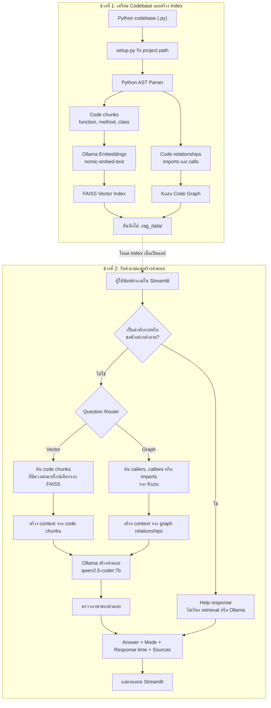

# Local Coding Assistant — ผู้ช่วยวิเคราะห์ Python Codebase

> **Mini Project — Selected Topic in SI**
>
> Local Vector + Graph Hybrid RAG สำหรับทำความเข้าใจ Python Codebase

## อ่าน README ตามเป้าหมาย (Reading Guide)

| ต้องการทราบเรื่อง | อ่านหัวข้อ |
| --- | --- |
| โปรเจกต์นี้ทำอะไร | 1–3: ภาพรวม วัตถุประสงค์ และขอบเขต |
| Codebase เดินทางไปเป็นคำตอบอย่างไร | 4–5: Flowchart, Vector, Graph และ Sources |
| ต้องการเปิดระบบทันที | 7–8: ข้อกำหนดและขั้นตอนเริ่มใช้งาน |
| ต้องการใช้กับ codebase ของตัวเอง | 9: การใช้ Python Codebase อื่น |
| ไม่รู้ว่าจะถามอะไร | 10: ตัวอย่างคำถามและการอ่านผลลัพธ์ |
| ต้องการดู Dataset และไฟล์ในโปรเจกต์ | 11–13: Dataset, โครงสร้าง และเนื้อหารายวิชา |
| ต้องการตรวจสอบหรือแก้ปัญหา | 14–17: Tests, Offline, ข้อจำกัด และ Troubleshooting |

## 1. ภาพรวมโปรเจกต์ (Project Overview)

Local Coding Assistant คือระบบถาม–ตอบเกี่ยวกับ Python codebase ที่ทำงานภายใน
เครื่อง ระบบไม่ได้ส่ง source code ไปยัง cloud และไม่ได้ตอบจากความรู้ของโมเดล
เพียงอย่างเดียว แต่จะค้นข้อมูลจาก codebase ที่ index ไว้ก่อน แล้วส่งเฉพาะ
context ที่ค้นพบให้ Ollama สร้างคำตอบ

โปรเจกต์ประยุกต์เนื้อหาจากรายวิชา Selected Topic in SI ได้แก่ Embeddings,
RAG Pipeline, Python AST, Code Graph, Hybrid Router, Ollama และ Streamlit
ให้กลายเป็นระบบที่ทดลองใช้งานได้จริงตั้งแต่การ index codebase จนถึงการแสดง
คำตอบพร้อม Sources

## 2. วัตถุประสงค์ (Objectives)

- ประยุกต์ใช้ Retrieval-Augmented Generation กับ Python source code
- สาธิตความแตกต่างระหว่าง Vector retrieval และ Graph retrieval
- สร้าง Router ที่เลือกวิธีค้นหาให้เหมาะกับคำถาม
- ใช้ Ollama ทำ embeddings และสร้างคำตอบแบบ local
- แสดงหลักฐานการค้นคืนผ่าน Mode, Sources, บรรทัด และ code snippet
- สร้าง Streamlit chat interface สำหรับทดลองและสาธิตระบบ

## 3. ขอบเขตของระบบ (System Scope)

### ส่วนประกอบของระบบ (System Components)

1. **Python Test Codebase** — Dataset ต้นทางสำหรับสร้าง Vector index และ
   Code Graph รวมถึงใช้ตรวจสอบว่า Sources อ้างอิงโค้ดจริง
2. **Local Coding Assistant** — Application สำหรับ index, retrieve และตอบ
   คำถามผ่านหน้า Streamlit

ระบบรองรับ Python source code (`.py`) โดยเน้นการอธิบายโค้ดและค้นความสัมพันธ์
ระหว่าง module, function, method, class, import และ function call

### สิ่งที่ยังไม่รองรับ (Not Supported)

- Document RAG สำหรับ PDF, Word, CSV หรือ Excel
- การอัปโหลดไฟล์ผ่านหน้า Streamlit
- การแก้ source code หรือสั่งรัน tests ผ่านแชต

หากต้องการเปลี่ยน codebase ให้ใช้ `setup.py` สร้าง index ใหม่ก่อนเปิด
Streamlit ตามขั้นตอนในหัวข้อ 9

## 4. ขั้นตอนการทำงาน (System Workflow)

ระบบแบ่งเป็นสองช่วง ได้แก่ การสร้าง index และการนำ index มาใช้ตอบคำถาม

> **จำแบบสั้น:** Codebase → AST → FAISS/Kuzu → Router → Ollama → Answer + Sources



### 4.1 การสร้างดัชนี (Indexing Flow)

1. ผู้ใช้เตรียม Python project เป็นโฟลเดอร์
2. `setup.py` รับ path ของโฟลเดอร์จาก `--project`
3. `ast_parser.py` อ่านไฟล์ `.py` และแยกข้อมูลเป็น:
   - code chunks สำหรับ Vector retrieval
   - imports และ function calls สำหรับ Graph retrieval
4. Ollama แปลง code chunks เป็น embeddings ด้วย `nomic-embed-text`
5. FAISS บันทึก vectors และ metadata สำหรับ semantic search
6. Kuzu บันทึก module, symbol และความสัมพันธ์เป็น Code Graph
7. ระบบบันทึกสถิติและตำแหน่ง codebase ใน `index_metadata.json`
8. Generated indexes ทั้งหมดอยู่ใต้ `.rag_data/`

### 4.2 การถาม–ตอบ (Query Flow)

1. Streamlit โหลด Vector index และ Graph database ผ่าน `st.cache_resource`
2. ผู้ใช้ส่งคำถามภาษาไทยหรือภาษาอังกฤษ
3. Help request จะได้รับคำแนะนำทันทีโดยไม่เรียก RAG หรือ Ollama
4. คำถามอื่นถูกส่งเข้า Question Router
5. Router เลือก Vector หรือ Graph ตาม intent และ keywords
6. Retriever ที่ถูกเลือกค้น context และ Sources จาก index จริง
7. ระบบส่งเฉพาะ retrieved context ให้ `qwen2.5-coder:7b`
8. คำตอบภาษาไทยถูกตรวจไม่ให้อักษรจีน ญี่ปุ่น หรือเกาหลีปน
9. Streamlit แสดง Answer, Mode, Response time และ Sources

## 5. เปรียบเทียบ Vector และ Graph (Vector vs Graph)

Hybrid RAG มี retrieval mode หลักสองแบบ:

| Mode | ใช้เมื่อ | วิธีค้นหา | ตัวอย่าง |
| --- | --- | --- | --- |
| Vector | ต้องการอธิบายว่าโค้ดทำอะไรหรือทำงานอย่างไร | ค้น code chunks ที่มีความหมายใกล้เคียงด้วย Ollama embeddings + FAISS | `ฟังก์ชัน mean ทำงานอย่างไร` |
| Graph | ต้องการทราบความสัมพันธ์ของโค้ด | ค้น imports และ calls ที่พบจาก Python AST ใน Kuzu | `ใครเรียก mean` |

Help response เป็นฟังก์ชันช่วยเริ่มต้น ไม่ใช่ retrieval mode เมื่อผู้ใช้พิมพ์
`สวัสดี` หรือ `ถามอะไรได้บ้าง` ระบบจะตอบตัวอย่างคำถามโดยไม่เรียก FAISS,
Kuzu หรือ Ollama

### ทำความเข้าใจแหล่งอ้างอิง (Understanding Sources)

- **Vector Sources** คือ code chunks ที่ FAISS จัดอันดับว่าใกล้เคียงกับคำถาม
- **Graph Sources** คือ symbol ที่พบในความสัมพันธ์จริงจาก Kuzu
- จำนวน Sources คือจำนวน retrieved chunks หรือ symbols ไม่ใช่จำนวนไฟล์ทั้งหมด
- หลาย Sources อาจมาจากไฟล์เดียวกัน เพราะหนึ่งไฟล์มีหลาย function หรือ class

## 6. ความสามารถหลัก (Key Features)

- Index โฟลเดอร์ Python ที่ผู้ใช้ระบุ
- แยก module, function, method, class, import และ function call ด้วย AST
- ค้นโค้ดเชิงความหมายด้วย FAISS
- ค้น callers, callees และ imports ด้วย Kuzu
- เลือก Vector หรือ Graph mode ตามคำถาม
- รองรับคำถามภาษาไทยและภาษาอังกฤษ
- ป้องกันอักษรจีน ญี่ปุ่น หรือเกาหลีปนในคำตอบภาษาไทย
- แสดงไฟล์, symbol, บรรทัด, similarity score และ code snippet
- แสดง response time และเก็บ chat history ใน session
- ล้างประวัติด้วย Clear Chat
- ทำงานแบบ local โดยไม่ใช้ API key

## 7. ข้อกำหนดของระบบ (System Requirements)

- Windows, macOS หรือ Linux
- [uv](https://docs.astral.sh/uv/)
- [Ollama](https://ollama.com/)
- พื้นที่ว่างประมาณ 6 GB สำหรับ models และ Python environment

โปรเจกต์ใช้ Python `>=3.12,<3.13` และมี `.python-version` กำหนด Python
3.12 ไว้แล้ว

| หน้าที่ | Model |
| --- | --- |
| สร้าง embeddings | `nomic-embed-text` |
| สร้างคำตอบ | `qwen2.5-coder:7b` |

## 8. เริ่มใช้งานตั้งแต่ต้น (Getting Started)

### ขั้นที่ 1 — ดาวน์โหลด Source Code (Get the Source Code)

Clone repository แล้วเข้าไปที่ project root:

```powershell
git clone https://github.com/Wattanaroj2567/selected-topic-si-llm-code-assistant.git
cd selected-topic-si-llm-code-assistant
```

หากมี source code อยู่ในเครื่องแล้ว ให้เปิด terminal ที่ project root และข้าม
ขั้นตอน clone ได้

### ขั้นที่ 2 — ติดตั้ง Dependencies (Install Dependencies)

```powershell
uv sync --locked
```

คำสั่งนี้สร้าง `.venv` และติดตั้ง package ตาม `uv.lock`

### ขั้นที่ 3 — เปิด Ollama และดาวน์โหลด Models (Start Ollama and Pull Models)

เปิด Ollama Desktop ก่อน หรือเปิดอีก terminal แล้วรัน:

```powershell
ollama serve
```

ถ้า Ollama Desktop เปิด service อยู่แล้ว ไม่ต้องรัน `ollama serve` ซ้ำ

จากนั้นกลับมาที่ terminal ของโปรเจกต์แล้วรัน:

```powershell
ollama pull qwen2.5-coder:7b
ollama pull nomic-embed-text
ollama list
```

### ขั้นที่ 4 — สร้าง Vector และ Graph Indexes (Build Indexes)

ใช้ Dataset ตัวอย่างที่อยู่ในโปรเจกต์:

```powershell
uv run python setup.py --project test_codebase
```

ผลที่ควรได้:

```text
Files: 6/6
Chunks: 9
Graph nodes: 20
Graph edges: 31
```

ระบบจะสร้าง:

```text
.rag_data/
├── index_metadata.json
├── vector/
│   ├── index.faiss
│   ├── documents.json
│   └── metadata.json
└── graph/
    └── code_graph.kuzu
```

`.rag_data/` เป็น generated cache ที่สร้างใหม่ได้ ส่วน source-of-truth คือ
Python codebase ต้นทาง

### ขั้นที่ 5 — เปิด Streamlit (Run the Web App)

```powershell
uv run streamlit run app.py
```

เปิด [http://localhost:8501](http://localhost:8501)

สามารถใช้ entry point ตาม Session 13 ได้เช่นกัน:

```powershell
uv run streamlit run lab_13_app.py
```

### ขั้นที่ 6 — ทดลองถาม (Try Example Questions)

ทดลองตามลำดับนี้เพื่อดู core flow ครบ:

1. Vector: `ฟังก์ชัน mean ทำงานอย่างไร`
2. เปิด Sources และตรวจ `metrics.py`
3. Graph: `ใครเรียก mean`
4. เปิด Sources และตรวจ `metrics.variance` กับ `reporting.build_report`
5. กด Clear Chat และยืนยันว่าประวัติหายทั้งหมด

## 9. การใช้ Python Codebase อื่น (Index Another Codebase)

ระบบไม่มี file uploader ในหน้าเว็บ เพราะการเพิ่ม codebase ต้อง parse หลายไฟล์
และสร้าง Vector กับ Graph indexes ใหม่

1. ปิด Streamlit ด้วย `Ctrl+C`
2. เตรียม Python project เป็นโฟลเดอร์
3. รัน indexing โดยส่ง path ของ project:

```powershell
uv run python setup.py --project "D:\path\to\python-project"
```

4. ตรวจสถิติที่แสดงหลัง index เสร็จ
5. เปิด Streamlit ใหม่

ถ้าได้รับ project เป็น ZIP ให้แตกไฟล์ก่อนแล้วจึง index โฟลเดอร์ที่แตกออกมา

สามารถเลือกเก็บ index ที่ตำแหน่งอื่นได้:

```powershell
uv run python setup.py `
  --project "D:\path\to\python-project" `
  --data-dir "D:\path\to\rag-data"

$env:RAG_DATA_DIR = "D:\path\to\rag-data"
uv run streamlit run app.py
```

## 10. ตัวอย่างคำถามและการอ่านผลลัพธ์ (Questions and Results)

ควรใช้ชื่อ function, class หรือ module ตามที่ปรากฏใน source code เช่น
`mean`, `run_pipeline` และ `pipeline`

### คำถามแบบ Vector (Vector Questions)

- `ฟังก์ชัน mean ทำงานอย่างไร`
- `อธิบายการทำงานของ run_pipeline`
- `ฟังก์ชัน standard_deviation คำนวณอย่างไร`
- `What does the mean function do?`

### คำถามแบบ Graph (Graph Questions)

- `ใครเรียก mean`
- `run_pipeline เรียกฟังก์ชันอะไรบ้าง`
- `pipeline นำเข้าอะไรบ้าง`
- `Who calls the mean function?`

### คำถามขอความช่วยเหลือ (Help Questions)

- `สวัสดี`
- `ถามอะไรได้บ้าง`
- `ช่วยแนะนำคำถามหน่อย`

### การอ่านผลลัพธ์ (Understanding the Response)

- **Answer** — คำตอบที่อ้างอิง retrieved context
- **Mode** — Vector, Graph หรือ Help
- **Response time** — เวลาที่ใช้ประมวลผล
- **Sources** — ไฟล์, symbol, บรรทัด, snippet และ similarity score เท่าที่มี
- **Clear Chat** — ล้างประวัติการสนทนา

## 11. ชุดข้อมูลตัวอย่าง (Example Dataset)

`test_codebase/` คือ Python knowledge base ที่ระบบใช้ทดสอบจริง ประกอบด้วย
Python 6 ไฟล์ มี imports และ function calls ข้ามไฟล์:

```text
test_codebase/
├── data_loader.py       # load_numbers
├── metrics.py           # mean, variance, standard_deviation
├── pipeline.py          # run_pipeline
├── reporting.py         # StatisticsReport, build_report
├── main.py              # main
└── __init__.py
```

ไฟล์ `example_numbers.txt` เป็นข้อมูลตัวอย่างที่ pipeline อ่าน แต่ไม่ถูกนำไป
สร้าง code chunks เพราะไม่ใช่ Python source code

## 12. โครงสร้างโปรเจกต์ (Project Structure)

| Path | หน้าที่ |
| --- | --- |
| `app.py` | Streamlit UI และ chat history |
| `setup.py` | CLI สำหรับ index Python project |
| `ast_parser.py` | แยก code chunks และ relationships ด้วย AST |
| `rag_pipeline.py` | สร้าง/โหลด FAISS, Vector RAG และตรวจภาษาคำตอบ |
| `code_graph.py` | สร้างและ query Kuzu graph |
| `hybrid_rag.py` | Router, Graph RAG, Help response และ response contract |
| `ollama_client.py` | ติดต่อ Ollama HTTP API |
| `config.py` | Models, paths และ runtime settings |
| `lab_12_hybrid_rag.py` | Entry point ตามชื่อ Lab 12 |
| `lab_13_coding_assistant.py` | Entry point ตามชื่อ Lab 13 สำหรับโหลด assistant |
| `lab_13_app.py` | Entry point ตามชื่อ Lab 13 สำหรับเปิด Streamlit |
| `test_codebase/` | Python Dataset ตัวอย่าง |
| `tests/` | Unit, integration และ real E2E tests |

โครงสร้างแยก implementation ตามหน้าที่ แต่ยังมี entry points ตามชื่อไฟล์ใน
Lab 12–13 เพื่อให้เห็นความเชื่อมโยงกับรายวิชา

## 13. ความเชื่อมโยงกับรายวิชา (Course Alignment)

| เนื้อหารายวิชา | Implementation ใน Mini Project |
| --- | --- |
| Session 07–08: Embeddings และ RAG Pipeline | `rag_pipeline.py` + Ollama embeddings + FAISS |
| Session 10–11: Graph DB และ Code Graph | `ast_parser.py` + `code_graph.py` + Kuzu |
| Session 12: Question Router และ HybridRAG | `hybrid_rag.py` + `lab_12_hybrid_rag.py` |
| Session 13: Coding Assistant UI | `app.py` + `lab_13_coding_assistant.py` + `lab_13_app.py` |

## 14. การทดสอบ (Testing)

### การทดสอบอัตโนมัติ (Automated Tests)

ไม่เรียก Ollama model จริง:

```powershell
uv run pytest -q
```

ผลล่าสุด: `34 passed`

### การตรวจ Lint และ Format (Code Quality)

```powershell
uv run ruff check .
uv run ruff format --check .
```

ผลล่าสุด: ผ่านทั้งสองคำสั่ง

### การทดสอบระบบจริง (Real End-to-End Test)

ต้องเปิด Ollama และสร้าง indexes ก่อน:

```powershell
uv run python tests/e2e_smoke.py
```

ผลล่าสุด: `12/12 passed`

ชุด E2E เรียก Ollama, FAISS และ Kuzu จริง ครอบคลุมคำถามภาษาไทยและอังกฤษใน
Vector, Graph และ Help response

### สถานะที่ตรวจสอบล่าสุด (Latest Verified Status)

ตรวจสอบเมื่อ 21 กันยายน 2026:

- Python 3.12.12
- Index: 6 files, 9 chunks, 20 graph nodes และ 31 graph edges
- Automated tests: 34/34 ผ่าน
- Ruff lint และ format: ผ่าน
- Real Ollama/FAISS/Kuzu E2E: 12/12 ผ่าน
- Streamlit UI: Help, Vector, Graph, Sources, unknown symbol และ Clear Chat ผ่าน

## 15. การทำงาน Offline และความเป็นส่วนตัว (Offline and Privacy)

หลังจากติดตั้ง dependencies และดาวน์โหลด Ollama models แล้ว การ index และถาม
คำถามสามารถทำงานโดยไม่ใช้อินเทอร์เน็ตได้

- Source code, Vector index และ Graph database อยู่ในเครื่อง
- Ollama ทำ embeddings และสร้างคำตอบในเครื่อง
- ไม่ต้องใช้ API key
- ไม่ควร index secrets, credentials หรือข้อมูลที่ไม่มีสิทธิ์เข้าถึง

## 16. ข้อจำกัดของเวอร์ชันปัจจุบัน (Current Limitations)

- รองรับ Python source code เท่านั้น
- หน้า Streamlit รับข้อความอย่างเดียว ไม่มี file uploader
- ต้องสร้าง indexes ใหม่เมื่อเปลี่ยน codebase หรือ embedding model
- คำถาม Graph ควรระบุชื่อ symbol ภาษาอังกฤษตาม source code
- ระบบช่วยทำความเข้าใจโค้ด แต่ยังไม่แก้ไฟล์หรือรัน tests ตามคำสั่งในแชต

## 17. การแก้ปัญหา (Troubleshooting)

### ติดต่อ Ollama ไม่ได้ (Ollama Connection Error)

```powershell
ollama serve
ollama list
```

ระบบรองรับ `OLLAMA_HOST` ทั้ง `127.0.0.1:11434` และ
`http://127.0.0.1:11434`

### ไม่พบ Vector หรือ Graph Index (Missing Index)

```powershell
uv run python setup.py --project test_codebase
```

### เปลี่ยน Embedding Model แล้วเปิด Index ไม่ได้ (Model Mismatch)

เป็น safety check เพื่อป้องกัน model หรือ vector dimensions ไม่ตรงกัน ให้สร้าง
indexes ใหม่ด้วย model ปัจจุบัน

### Python File มี Syntax Error (Invalid Python Syntax)

Indexer จะข้ามเฉพาะไฟล์ที่ parse ไม่ได้ แสดง warning และ index ไฟล์อื่นต่อ

### Streamlit ยังแสดง Codebase เดิม (Stale Cache)

ปิด Streamlit, สร้าง indexes ใหม่ แล้วเปิด Streamlit อีกครั้ง เพื่อให้
`st.cache_resource` โหลดข้อมูลชุดใหม่
